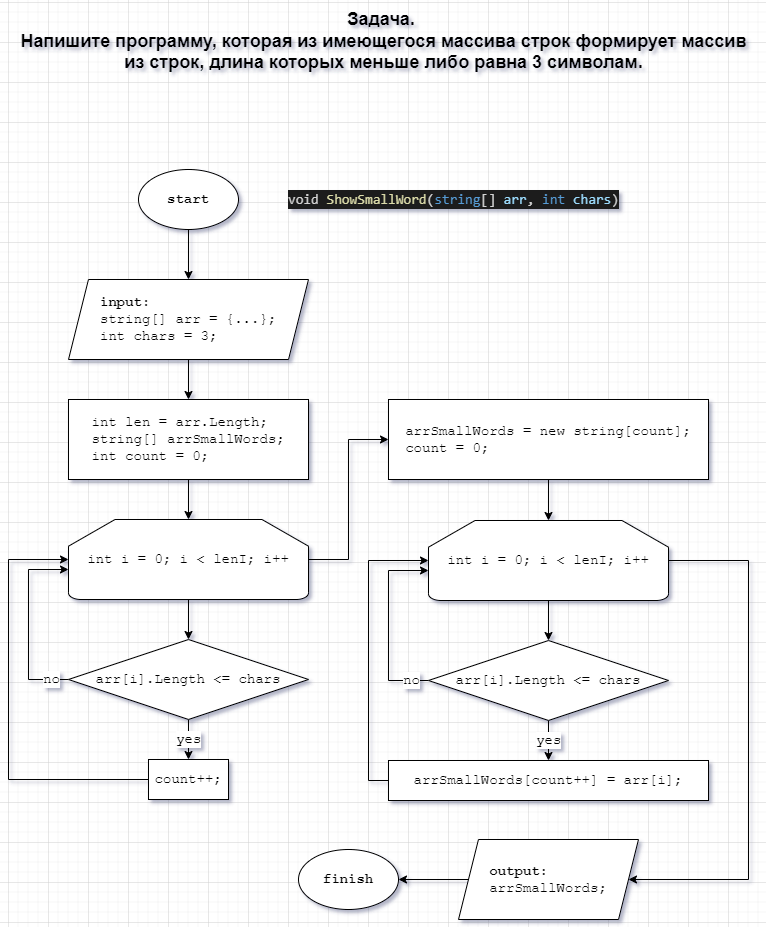

# Итоговая проверочная работа.
## **Задача.** Напишите программу, которая из имеющегося массива строк формирует массив из строк, длина которых меньше либо равна 3 символам.

***
## **Решение:**

В метод **ShowSmallWord()** *первым* параметром, передается строковой массив, каждый элемент которого это массив из строк, а *вторым* параметром - максимальная длина элементов массива, которые необходимо сохранить и вывести. Например:
```
string[][] arrWords = {
    new string[]{"hello", "2", "world", ":-)"},
    new string[]{"1234", "1567", "-2", "computer science"},
    new string[]{"Russia", "Denmark", "Kazan", "Ufa", "Omsk"},
    new string[]{ "Sunday", "Monday", "Tuersday", "Wednesday", "Thirsday", "Friday", "Saturday" },
    // add your array here
};
```
Данный массив может быть дополнен своими значениями и массивами для проверки в формате:
`new string[]{"word 1", "word 2", "word 3", "...", "etc"},`


В данном случае задачу можно решить несколькими способами.
В случае, если необходимо получить только вывод элементов массива, имеющих длину меньшую или равную трем, то мы можем создать массив аналогичной длины, но поместить в него только те элементы, которые имеют длину <= 3.
Некоректность данного решения в том, что фактически мы получаем массив той же длины что и исходный.
Ниже приведен пример подобного решения, в котором сделан акцент именно на визуальный вывод данных в правильном формате.
Код метода **ShowSmallWord()** вариант 1:

```
void ShowSmallWord(string[][] arr, int chars){
    int lenI = arr.Length;
    int lenJ;
    string[] arrSmallWords;

    for(int i = 0; i < lenI; i++){
        lenJ = arr[i].Length;
        arrSmallWords = new string[lenJ];
        int k = 0;

        for(int j = 0; j < lenJ; j++){
            arrSmallWords[j] = String.Empty;
            if(arr[i][j].Length <= chars){
                if(k > 0){
                    arrSmallWords[j] = ",";
                };
                k++;
                arrSmallWords[j] += $"'{arr[i][j]}'";
            };
        };
        Console.WriteLine($"[{String.Join(",", arr[i])}] -> [{String.Join("", arrSmallWords)}]");
    };    
};
```




