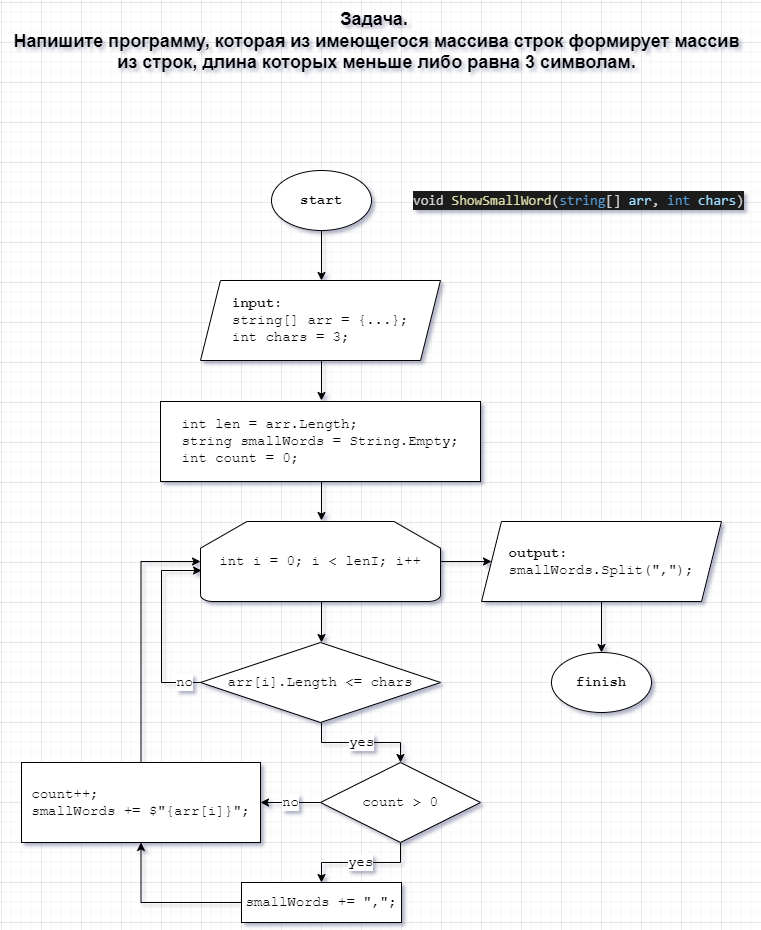

# Итоговая проверочная работа.
## **Задача.** Напишите программу, которая из имеющегося массива строк формирует массив из строк, длина которых меньше либо равна 3 символам.

***
## **Решение:**

В метод **ShowSmallWord()** *первым* параметром, передается строковой массив, в формате:

`new string[]{"word 1", "word 2", "word 3", "...", "etc"}`

*Вторым* параметром - числовое значение максимальной длины элементов массива, которые необходимо сохранить и вывести.

Например:

`ShowSmallWord(new string[]{"hello", "2", "world", ":-)"}, 3);`

или

`ShowSmallWord(new string[]{"Russia", "Denmark", "Kazan", "Ufa", "Omsk"}, 3);`

В данном случае задачу можно решить несколькими способами.
***
**Вариант 1.**

Из-за особенностей C#, при создании массива, мы вынуждены задавать его длину в момент создания и не имеем возможности изменять его длину в большую или меньшую сторону. В связи с этим, нам необходимо сначала узнать каково количество элементов, которое мы планируем положить в новый массив.

Для этого, мы делаем цикл по всему массиву, считая количество элементов, подпадающих под условие задачи.
Получив итоговое количество элементов, мы создаем массив нужной длины и делаем еще один цикл по первоначальному массиву, добавляя в новый массив значения, при соблюдении условия задачи.

Код метода **ShowSmallWord()**, вариант 1:

```

string[] ShowSmallWord(string[] arr, int chars){
    int len = arr.Length;
    string[] arrSmallWords;
    int count = 0;

    for(int i = 0; i < len; i++){
        if(arr[i].Length <= chars){
            count++;
        };
    };

    arrSmallWords = new string[count];
    count = 0;
    for(int i = 0; i < len; i++){
        if(arr[i].Length <= chars){
            arrSmallWords[count++] = arr[i];
        };
    };
    return arrSmallWords;  
};
```


***
**Вариант 2.**

В данном случае, мы выполняем один цикл, в котором сохраняем искомые данные в строку с разделитем, например запятой и далее разбиваем строку с помощью метода **Split**.

Код метода **ShowSmallWord()**, вариант 2:

```
string[] ShowSmallWord(string[] arr, int chars){
    int len = arr.Length;
    string smallWords = String.Empty;
    int count = 0;

    for(int i = 0; i < len; i++){
        if(arr[i].Length <= chars){
            if(count > 0){
                smallWords += ",";
            };
            count++;
            smallWords += $"{arr[i]}";
        };
    };
    return smallWords.Split(",");
};
```



